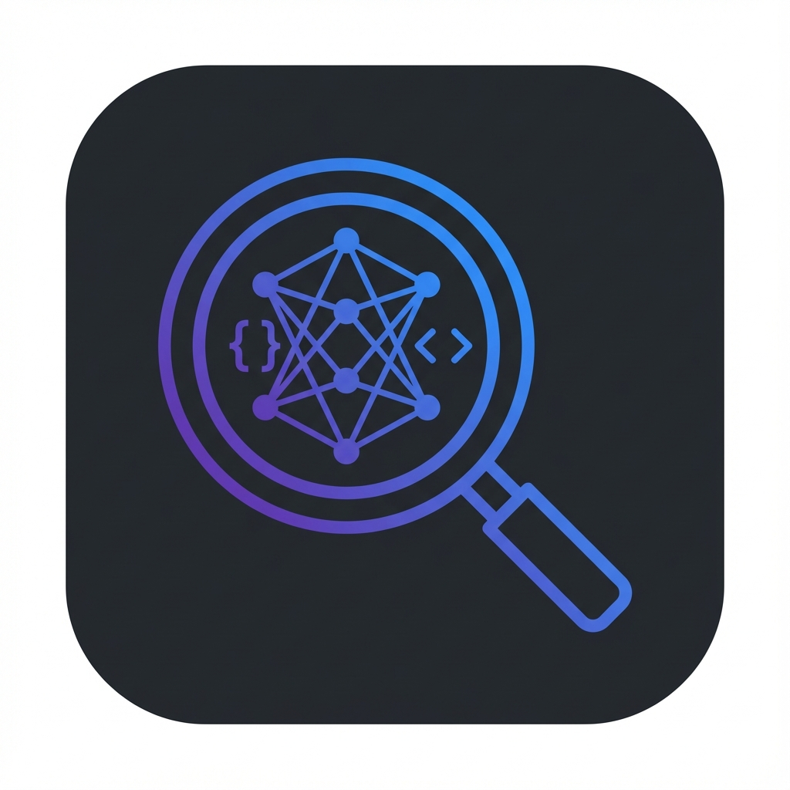

# Context Engine

[](https://marketplace.visualstudio.com/items?itemName=context-engine.context-engine)
[](https://opensource.org/licenses/MIT)

AI-powered codebase context engine for intelligent code search and prompt enhancement.



## Features

### 🔍 Semantic Code Search
Find code using natural language queries. No more keyword hunting – describe what you're looking for and get relevant results.

```
"authentication middleware" → finds auth-related code
"database connection handling" → finds DB setup code
"error handling patterns" → finds try/catch implementations
```

### ✨ Prompt Enhancement
Transform simple prompts into detailed, context-aware instructions with relevant code snippets automatically included.

**Before:** "fix the login bug"

**After:** "Debug and fix the user authentication issue in the login flow. Specifically, investigate the `AuthService.login()` method in `src/auth/service.ts` which handles JWT token validation..."

### 📊 Sidebar Views
- **Status View** - Connection status, index health, file counts
- **Search Results** - Click to open matching files
- **Recent Searches** - Quick re-run of previous queries

### 💡 CodeLens Integration
Inline actions appear above functions and classes:
- **Find Related Code** - Search for usage and implementations
- **Get Context** - Get AI-enhanced explanation

Supports: TypeScript, JavaScript, Python, Go, Rust, Java, Kotlin, C#, Dart

### 🔄 Health Monitoring
- Automatic reconnection on connection loss
- Status bar indicator shows real-time connection state
- Configurable health check intervals

### 🚀 Server Management
- Auto-start server on extension activation
- Start/Stop server commands
- Automatic server discovery

## Installation

### From VS Code Marketplace
1. Open VS Code
2. Press `Ctrl+P` / `Cmd+P`
3. Run: `ext install context-engine.context-engine`

### From VSIX
1. Download the `.vsix` file from releases
2. Open VS Code
3. Press `Ctrl+Shift+P` / `Cmd+Shift+P`
4. Run: `Extensions: Install from VSIX...`
5. Select the downloaded file

## Quick Start

### 1. Start the Server
```bash
cd /path/to/context-engine
npx tsx src/index.ts --workspace /your/project --http-only --port 3333
```

### 2. Connect
The extension auto-connects on startup. You can also:
- Click the status bar item
- Run: `Context Engine: Connect to Server`

### 3. Search
- Click the search icon in the Activity Bar
- Run: `Context Engine: Semantic Search`
- Use CodeLens "Find Related" on any function

## Commands

| Command | Description | Keybinding |
|---------|-------------|------------|
| Connect to Server | Connect to Context Engine | - |
| Disconnect from Server | Disconnect from server | - |
| Show Index Status | Display workspace index info | - |
| Index Workspace | Index/reindex the workspace | - |
| Semantic Search | Search the codebase | - |
| Enhance Prompt | Enhance prompt with context | - |
| Start Server | Start the server process | - |
| Stop Server | Stop the server process | - |
| Show Output | Open the output channel | - |

## Settings

| Setting | Default | Description |
|---------|---------|-------------|
| `contextEngine.serverUrl` | `http://localhost:3333` | Server URL |
| `contextEngine.autoConnect` | `true` | Auto-connect on startup |
| `contextEngine.showStatusBar` | `true` | Show status in status bar |
| `contextEngine.maxSearchResults` | `20` | Maximum search results |
| `contextEngine.maxRecentSearches` | `10` | Maximum recent searches |
| `contextEngine.enableCodeLens` | `true` | Show CodeLens on definitions |
| `contextEngine.enableHealthMonitoring` | `true` | Enable health monitoring |
| `contextEngine.healthCheckInterval` | `30000` | Health check interval (ms) |
| `contextEngine.serverPath` | `""` | Path to server script |
| `contextEngine.autoStartServer` | `false` | Auto-start server |

## Requirements

- **VS Code** 1.85.0 or higher
- **Node.js** 18+ (for the server)
- **Context Engine MCP Server** running with HTTP mode

## Architecture

```
┌─────────────────────────────────────────────────────────┐
│                    VS Code Extension                     │
├─────────────────────────────────────────────────────────┤
│  Commands │ TreeViews │ CodeLens │ StatusBar │ Output  │
├─────────────────────────────────────────────────────────┤
│                 ContextEngineClient                      │
│                    (HTTP Client)                         │
└─────────────────────────────────────────────────────────┘
                          │ HTTP
                          ▼
┌─────────────────────────────────────────────────────────┐
│                Context Engine Server                     │
├─────────────────────────────────────────────────────────┤
│  Express HTTP │ Routes │ Middleware │ CORS │ Logging   │
├─────────────────────────────────────────────────────────┤
│               ContextServiceClient                       │
├─────────────────────────────────────────────────────────┤
│  Semantic Search │ Indexing │ Context │ Enhancement     │
└─────────────────────────────────────────────────────────┘
```

## Development

### Build
```bash
cd vscode-extension
npm install
npm run compile
```

### Watch Mode
```bash
npm run watch
```

### Test
```bash
npm test
```

### Package
```bash
npm run package
# Creates context-engine-{version}.vsix
```

### Debug
1. Open `vscode-extension/` folder in VS Code
2. Press F5 to launch Extension Development Host
3. Set breakpoints in TypeScript files

## Troubleshooting

### "Failed to connect to Context Engine"
1. Ensure the server is running: `npx tsx src/index.ts --workspace . --http-only`
2. Check the server URL in settings
3. Verify the port is not in use

### "No results found"
1. Run `Context Engine: Index Workspace` first
2. Check the output channel for errors
3. Ensure files are not in `.gitignore`

### CodeLens not showing
1. Check `contextEngine.enableCodeLens` is `true`
2. Ensure the file is a supported language
3. Try closing and reopening the file

### Server won't auto-start
1. Configure `contextEngine.serverPath` with the correct path
2. Ensure Node.js is in PATH
3. Check the output channel for errors

## Contributing

Contributions are welcome! Please read our contributing guidelines first.

1. Fork the repository
2. Create your feature branch: `git checkout -b feature/amazing-feature`
3. Commit your changes: `git commit -m 'Add amazing feature'`
4. Push to the branch: `git push origin feature/amazing-feature`
5. Open a Pull Request

## License

This project is licensed under the MIT License - see the [LICENSE](../LICENSE) file for details.

## Acknowledgments

- Built with [VS Code Extension API](https://code.visualstudio.com/api)
- Powered by [Context Engine MCP Server](https://github.com/Kirachon/context-engine)
